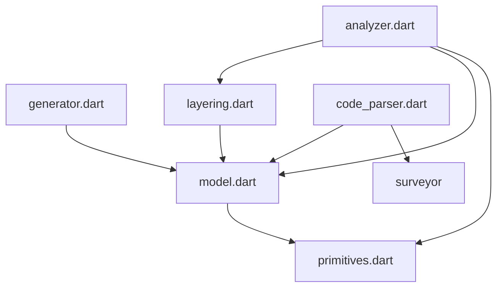

# LayerLens

Generate a dependency diagram in every folder of your source code.



## Disclaimer

This project is not an official Google project. It is not supported by
Google and Google specifically disclaims all warranties as to its quality,
merchantability, or fitness for a particular purpose.

## Prerequisites

Install `Markdown Preview Mermaid Support` extension to VSCode,
to see the diagrams in VSCode preview.

## Generate Diagrams

Run:

```
dart run layerlens
```

## Contributing

See [`CONTRIBUTING.md`](CONTRIBUTING.md) for details.

## License

Apache 2.0; see [`LICENSE`](LICENSE) for details.

