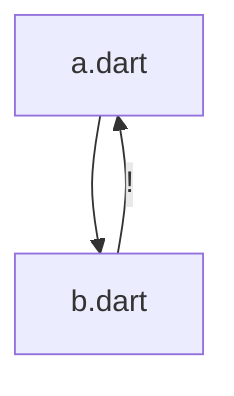

<!---
Generated by https://github.com/polina-c/layerlens
Dependencies that create loops (inversions) are marked with `!`.
-->

```mermaid
flowchart TD;
a.dart-->b.dart;
b.dart--!-->a.dart;
```

Inversions in this folder: 1
Inversions including subfolders: 1.

