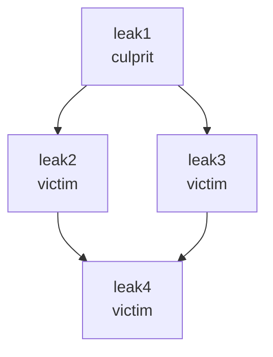

lib/src/DEPENDENCIES.md

```mermaid

   flowchart TD;
      l1[leak1\nculprit]
      l2[leak2\nvictim]
      l3[leak3\nvictim]
      l4[leak4\nvictim]
      l1-->l2;
      l1-->l3;
      l2-->l4;
      l3-->l4;
```
