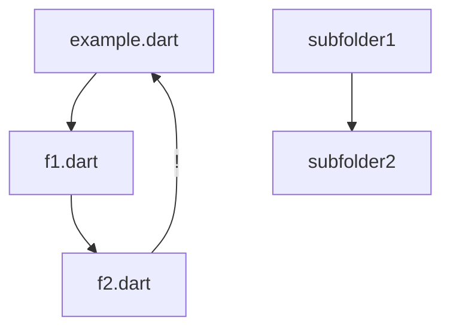

<!---
Generated by https://github.com/polina-c/layerlens
Dependencies that create loops (inversions) are marked with `!`.
-->

```mermaid
flowchart TD;
example.dart-->f1.dart;
f1.dart-->f2.dart;
f2.dart--!-->example.dart;
subfolder1-->subfolder2;
```

### Inversions
In this folder: 1

Including sub-folders: 2

